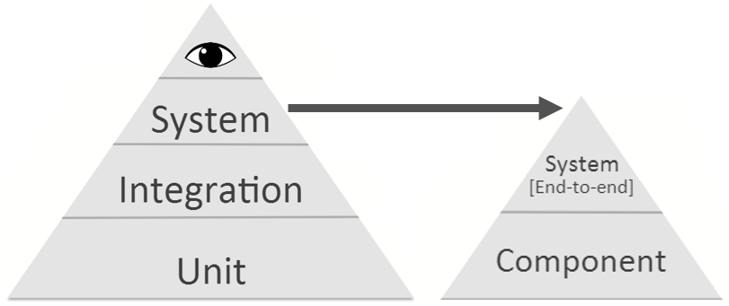

# Spring + Angular + Mongo + Protractor

This application was generated using JHipster, you can find documentation and help at [https://jhipster.github.io](https://jhipster.github.io).

Aside from the base JHipster scaffold, enhancements and contributions focused on best testing practices have been included. For more details, refer to the testing section below.

## Development

Before you can build this project, you must install and configure the following dependencies on your machine:

1. [Node.js][]: We use Node to run a development web server and build the project.
   Depending on your system, you can install Node either from source or as a pre-packaged bundle.

After installing Node, you should be able to run the following command to install development tools (like
[Bower][] and [BrowserSync][]). You will only need to run this command when dependencies change in package.json.

    npm install

We use [Gulp][] as our build system. Install the Gulp command-line tool globally with:

    npm install -g gulp

Run the following commands in two separate terminals to create a blissful development experience where your browser
auto-refreshes when files change on your hard drive.

    ./gradlew
    gulp

Bower is used to manage CSS and JavaScript dependencies used in this application. You can upgrade dependencies by
specifying a newer version in `bower.json`. You can also run `bower update` and `bower install` to manage dependencies.
Add the `-h` flag on any command to see how you can use it. For example, `bower update -h`.

## Testing

Tests are broken down as per the following test pyramid:

Within this sample application, several tests are included:

| Layer  | Purpose | Location |
| ------------- | ------------- | ------------- |
| System (End-to-End) | Test the application from **end-to-end**, involving all layers throughout the stack. | `src/test/javascript/e2e/` |
| System (Component)  | Test components of the system (such as user administration) with a partially mocked backend. Focuses on negative case UI interactions and cross-browser consistency. | `src/test/javascript/component/` |
| Integration (REST Resources)  | Test API endpoints that are exposed externally. | `src/test/java/../integration/resource/` |
| Integration (Internal Services)  | Test internal service classes to ensure proper interaction with other services (both internal and external, such as database components). | `src/test/java/../integration/service/` |
| Unit (Client)  | Test client-level controllers/services/directives at a unit level. | `src/test/javascript/unit/` |
| Unit (Backend)  | Test backend-level classes at a unit level. | `src/test/java/../unit/` |

## Client-side Testing

Client-side unit tests are run by [Karma][] and written with [Jasmine][]. They're located in `src/test/javascript/` and can be run with:

    gulp test

UI end-to-end and component tests are powered by [Protractor][], which is built on top of WebDriverJS. They're located in `src/test/javascript/e2e` and `src/test/javascript/component`
and can be run as follows:

1. Start Spring Boot in one terminal
 
    `./gradlew bootRun` 
    
2. Run the tests in another terminal

    `gulp itest`
    
UI end-to-end/component tests both utilize the page object pattern as described by the Protractor documentation on [page objects][].

## Server-side Testing

Server-side unit and integration tests are run via [Gradle][] and are written in [JUnit][]. They're located in `src/test/java/` and can be run with:

    ./gradlew test

The integration tests are configured to run using the [Flapdoodle][] in-memory [embedded MongoDB][]. 

This greatly simplifies data setup/teardown (since a clean DB is created on every run) while still providing us a fairly high level of confidence in our integration point between the application and the persistence layer. 

## Testing Contributions (Work in Progress)

Although JHipster's scaffold comes with a fair amount of tests, our main contributions involve (~~striked~~: not completed yet):
* ~~For the User Administration feature, introduced test examples for every layer across the test pyramid~~
* ~~Introduced page objects for both UI component and end-to-end tests~~
* ~~Introduced [Angular Multimocks][] for mocking HTTP calls to backend (for component testing)~~
* Changed the package/directory structure to align with the proposed test strategy

[JHipster]: https://jhipster.github.io/
[Node.js]: https://nodejs.org/
[Bower]: http://bower.io/
[Gulp]: http://gulpjs.com/
[BrowserSync]: http://www.browsersync.io/
[Karma]: http://karma-runner.github.io/
[Jasmine]: http://jasmine.github.io/2.0/introduction.html
[Protractor]: https://angular.github.io/protractor/
[page objects]: http://www.protractortest.org/#/page-objects
[Gradle]: http://gradle.org/
[JUnit]: http://junit.org/junit4/
[Angular Multimocks]: https://github.com/wongatech/angular-multimocks
[embedded MongoDB]: https://github.com/flapdoodle-oss/de.flapdoodle.embed.mongo
[Flapdoodle]: https://github.com/flapdoodle-oss
